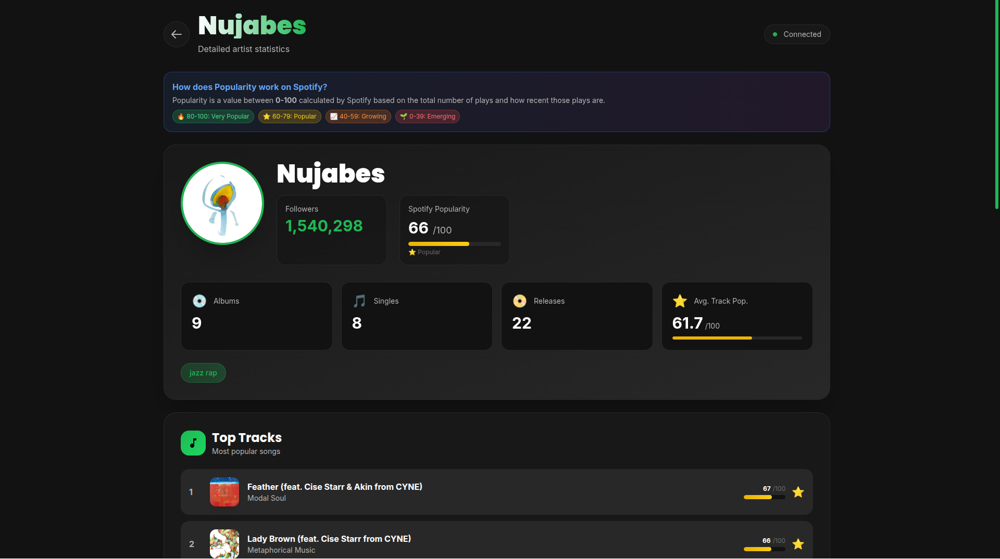

<div align="center">
  
  
  # Statify - Artist Analytics Dashboard for Spotify
  
  Statify is a containerized web application that provides comprehensive artist analytics powered by the Spotify API. Built with a modern tech stack, it delivers real-time insights into artist performance, track popularity, and distribution metrics.
</div>

<div align="center">
  
  
  
  
  
  
  
</div>

## Features

### Artist Analytics
- Real-time follower count and popularity tracking
- Top tracks performance metrics with visual indicators
- Complete discography analysis (albums, singles, compilations)
- Detailed popularity scoring (0-100 scale)
- Genre classification and categorization

### Distribution Insights
- Playlist discovery and tracking
- Track placement analytics
- Album distribution overview
- Release history and timeline

### Authentication
- Secure OAuth2 integration with Spotify
- Token-based session management
- Protected API endpoints

## Quick Start

### Prerequisites
- Docker and Docker Compose
- Spotify Developer Account
- Valid Spotify API credentials

### Setup Instructions

1. **Configure Spotify Developer Application**
   ```
   Navigate to: https://developer.spotify.com/dashboard
   Create new application
   Add redirect URI: http://127.0.0.1:5000/callback
   ```

2. **Environment Configuration**
   
   Create a `.env` file in the project root:
   ```bash
   SPOTIFY_CLIENT_ID=your_client_id
   SPOTIFY_CLIENT_SECRET=your_client_secret
   SPOTIFY_REDIRECT_URI=http://127.0.0.1:5000/callback
   ```

3. **Launch Application**
   ```bash
   chmod +x start.sh
   ./start.sh
   ```

4. **Access the Dashboard**
   ```
   Frontend: http://127.0.0.1:3000
   Backend API: http://127.0.0.1:5000
   ```

## Architecture

### Technology Stack

**Frontend**
- React 18.3.1
- Vite 6.0.1
- TailwindCSS 3.4.15
- Axios for HTTP requests

**Backend**
- FastAPI 0.115.0
- Spotipy 2.24.0 (Spotify API wrapper)
- Uvicorn ASGI server
- Python 3.11

**Infrastructure**
- Docker containerization
- Multi-container orchestration with Docker Compose
- Nginx reverse proxy ready

### API Endpoints

| Method | Endpoint | Description |
|--------|----------|-------------|
| GET | `/api/auth/login` | Initialize OAuth flow |
| GET | `/api/artist/search` | Search artists by query |
| GET | `/api/artist/{id}/overview` | Artist profile information |
| GET | `/api/artist/{id}/top-tracks` | Top performing tracks |
| GET | `/api/artist/{id}/albums` | Complete discography |
| GET | `/api/artist/{id}/playlists` | Playlist placements |
| GET | `/api/artist/{id}/analytics` | Aggregated analytics data |

### Project Structure

```
statify/
├── backend/
│   ├── app.py              # FastAPI application
│   ├── spotify_client.py   # Spotify API integration
│   ├── requirements.txt    # Python dependencies
│   └── Dockerfile
├── frontend/
│   ├── src/
│   │   ├── pages/         # React components
│   │   └── index.css      # Global styles
│   ├── package.json
│   └── Dockerfile
├── docker-compose.yml
└── start.sh
```

## Development

### Local Development Setup

**Backend**
```bash
cd backend
python -m venv venv
source venv/bin/activate
pip install -r requirements.txt
uvicorn app:app --reload
```

**Frontend**
```bash
cd frontend
npm install
npm run dev
```

### Docker Development
```bash
docker-compose up --build
```

## Screenshots



---

## License
This project is licensed under the MIT License. See the LICENSE file for details.

## Contributing
Contributions are welcome. Please open an issue first to discuss proposed changes.

## Author
**Bruno Alonso** - [GitHub](https://github.com/bait-py)